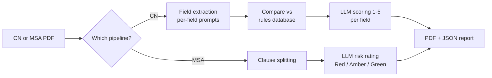

# ClauseGuard

An LLM-powered assistant for two contract-review tasks: checking whether a Cargo Nomination (CN) document complies with agreed nomination rules, and scanning a Master Sales Agreement (MSA) for risky clauses. Built to explore what an internal "ask questions about your contracts" tool actually takes to build — extraction, rule comparison, LLM-as-judge scoring, and clause-level risk rating, not just a single prompt call.

All data in this repo (company names, agreements, addresses) is synthetic. Sample PDFs are generated by `scripts/generate_sample_pdfs.py` for local testing.

## What it does

**1. Nomination rule compliance checking**
- Extract fields from a CN PDF using field-specific prompts (one prompt per field, each with its own extraction instructions)
- Compare each extracted field against the expected value in a rules database
- Score the match 1-5 using an LLM (not string equality — "seller" and "Solace Energy Trading Ltd" should match, a string compare would fail)
- Output a compliance report (terminal table + PDF + JSON)

**2. MSA risk matrix**
- Split an MSA PDF into clauses
- Rate each clause Red / Amber / Green for risk, with reasoning
- Three use cases: periodic scans, spot-checks, and draft validation before signing
- Output a risk report (terminal table + PDF + JSON)



## Tech stack

Python, OpenAI-compatible LLM API, SQLite, FastAPI, Typer (CLI), pdfplumber (extraction), ReportLab (PDF report generation), pytest, Poetry.

## Project structure

```
src/clauseguard/
  api.py                # FastAPI REST endpoints
  cli.py                # Typer CLI (setup-db, seed-db, check-cn, scan-msa)
  config.py              # environment/config loading
  database/               # SQLite schema + sample data seeding
  extraction/              # CN PDF parsing + per-field LLM extraction
  nomination/               # rule comparison + LLM scoring
  msa/                       # clause splitting + risk rating
  reports/                    # PDF report generation
  prompts/                     # one markdown file per extracted field
scripts/generate_sample_pdfs.py   # builds synthetic CN + MSA PDFs for testing
tests/                              # pytest suite, mocks the LLM calls
```

## Getting started

**Prerequisites:** Python 3.11+, [Poetry](https://python-poetry.org/), and an OpenAI-compatible API key (OpenAI, Groq, or similar).

```bash
poetry install
cp .env.example .env   # fill in your API key
```

Generate synthetic sample PDFs to test against:
```bash
poetry run python scripts/generate_sample_pdfs.py
```

Set up and seed the database:
```bash
poetry run clauseguard setup-db
poetry run clauseguard seed-db
```

Run a compliance check:
```bash
poetry run clauseguard check-cn data/pdfs/cn/sample_cn.pdf AGR-001 TG-100
```

Run a risk scan:
```bash
poetry run clauseguard scan-msa data/pdfs/msa/sample_msa.pdf periodic
```

Or run the API instead of the CLI:
```bash
poetry run uvicorn clauseguard.api:app --reload
```
Swagger UI at `http://localhost:8000/docs`.

## Testing

```bash
poetry run pytest tests/ -v
```

20 tests: unit tests for prompt building, extraction parsing, scoring, and clause splitting, plus two end-to-end tests that run the actual CLI commands (`check-cn`, `scan-msa`) against the generated sample PDFs and verify the full pipeline produces valid PDF + JSON reports. LLM calls are mocked at the API client boundary, so the whole suite runs without network access or API cost — including the end-to-end tests.
